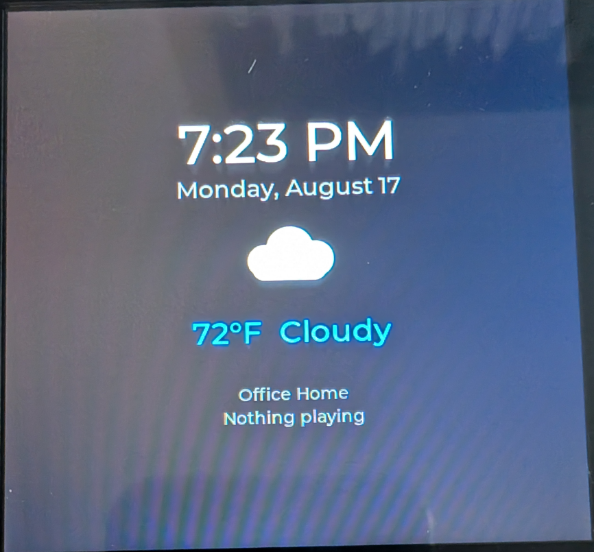
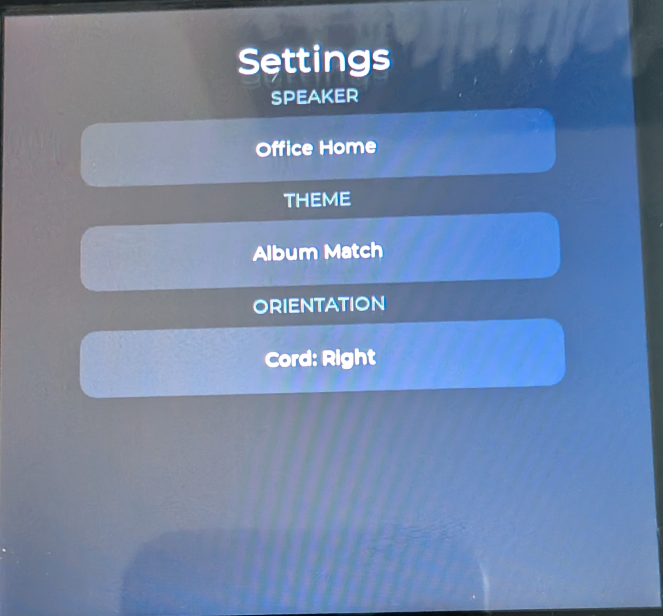
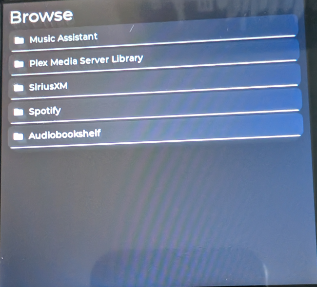
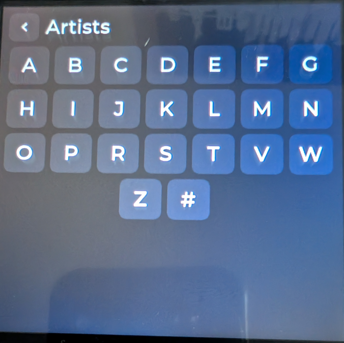
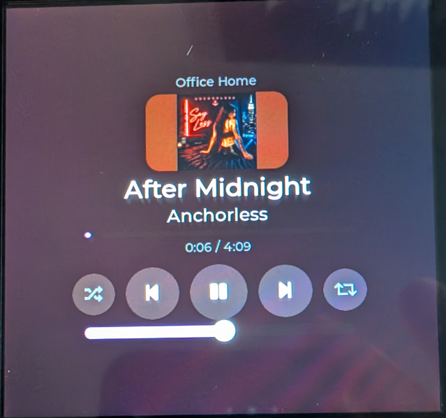

# MusicPanel

A wall-mounted (or desk-standing) touchscreen controller for [Music Assistant](https://www.music-assistant.io/), built on a low-cost ESP32-S3 display board. Pick a room, see what's playing with live album art, control playback, browse your whole library across every connected source, and — when the room is quiet — a clean idle dashboard with a clock and live weather.

Native **ESP-IDF + LVGL 9** firmware. No Arduino, no Home Assistant required — the panel talks directly to a Music Assistant server on your network.

Please consider donating to helping support future updates and development of this and my other projects!

[](https://ko-fi.com/B6U7259U1Y)

---

## Features

- **Now Playing** — room name, album art (decoded on-device), title/artist, a smooth progress bar, and transport controls (play/pause, next/previous, shuffle, repeat).
- **Volume** control per room.
- **Browse & play** — every source you've connected to Music Assistant (Spotify, Plex, local library, SiriusXM, Audiobookshelf, and more) through one unified interface. Drill Artists → Albums → Tracks, with an **A–Z picker** for large libraries.
- **Room selection** — associate the panel with any speaker/player; browse on the panel and it plays in that room.
- **Themes** — six built-in palettes plus **Album Match**, which derives a contrast-safe theme from the current album's colors, live, as songs change.
- **Idle dashboard** — large 12-hour clock, date, room, and current weather (temperature + a color condition icon) via Open-Meteo.
- **Four-way orientation** — mount it with the power cord exiting any side; set it in Settings.
- Wi-Fi provisioning and all configuration via a **phone-friendly setup page** — no re-flashing to change settings.






---

## Hardware

This firmware targets one specific, widely-available board:  https://www.amazon.com/dp/B0GL1PHKYG?ref_=ppx_hzsearch_conn_dt_b_fed_asin_title_1

| | |
|---|---|
| **Board** | Guition / JCZN **ESP32-4848S040** (sometimes sold as "Sparkle IoT" / AITRIP) |
| **MCU** | ESP32-S3 (WROOM-1-N16R8): 16 MB flash, 8 MB octal PSRAM |
| **Display** | 4.0" 480×480 IPS, ST7701S controller (16-bit RGB + 3-wire SPI init) |
| **Touch** | GT911 capacitive (I²C) |
| **USB** | CH340 (USB-serial) |

> ⚠️ **The prebuilt firmware is specific to this board.** Flashing it to different ESP32 hardware will not work. Search the board name above before buying.

---

## Quick start (for users) — no command line needed

You'll flash the firmware from your web browser, then finish setup from your phone.

### 1. Flash the firmware

1. Open the **[web installer](https://boundzero.github.io/MusicPanel/)** in a supported browser (see note below).
2. Plug the panel into your computer via USB.
3. Click **Install MusicPanel**, choose the serial port, and wait for it to finish.

**Browser support:** the installer uses the Web Serial API, which works in **Chrome, Edge, Brave, and Opera** on **Windows, macOS, Linux, and ChromeOS**. It does **not** work in Firefox or Safari — use a Chromium-based browser for this one-time step.

**Windows driver:** if no serial port appears, install the **CH340 driver** ([WCH official download](https://www.wch-ic.com/downloads/CH341SER_EXE.html)). macOS and most Linux distros already include it.

### 2. Configure from your phone

After flashing, the panel creates a Wi-Fi network named **`MusicPanel-XXXX`**.

1. On your phone, join that Wi-Fi network.
2. A setup page opens automatically (or visit `http://192.168.4.1`).
3. Enter:
   - **Wi-Fi** network + password
   - **Music Assistant server** address and port (default `8095`)
   - **Music Assistant token** (see below)
   - **Time zone** and **location** (city or ZIP, for the clock and weather)
4. Save. The panel reboots, connects, and you're done.

To change any setting later, open the panel's IP address in a browser on your network — same page.

### 3. Create a Music Assistant token

In Music Assistant: **Settings → (your profile) → create a Long-Lived Token**, then paste it into the setup page. The panel stores it securely in flash; it's never shown again.

---

## Building from source (for developers)

Requires **ESP-IDF v5.3.5** (other 5.x versions may work with minor tweaks).

```bash
git clone https://github.com/Boundzero/musicpanel.git
cd musicpanel

. $HOME/esp/esp-idf/export.sh      # source your ESP-IDF environment
idf.py set-target esp32s3
idf.py build
idf.py -p /dev/ttyUSB0 flash monitor
```

### Producing the merged binary for the web installer

The web installer flashes a single merged image (bootloader + partition table + app). After a successful build:

```bash
idf.py merge-bin -o docs/firmware/musicpanel-merged.bin
```

Commit the result to `docs/firmware/` and bump `version` in `docs/manifest.json`. GitHub Pages will then serve the updated installer. (A GitHub Actions workflow in `.github/workflows/` can build this for you on each release.)

---

## Project structure

```
components/
  bsp/        Display + touch + LVGL bring-up; four-way rotation
  network/    Wi-Fi (STA + SoftAP setup portal) and the config web page
  settings/   Persistent settings (NVS)
  ma/         Music Assistant REST client: now-playing, transport,
              album art, browse/play, alphabetical library navigation
  theme/      Color roles, six palettes + live Album-Match
  timesync/   SNTP + timezone for the idle clock
  weather/    Open-Meteo current conditions (HTTPS)
  logging/    Log facade
main/
  app_main.cpp   UI: swipe shell (Browse · Now Playing · Settings),
                 themed-widget registry, idle dashboard, weather icons
```

The design is deliberately hardware-agnostic in the BSP layer — porting to another RGB/ST7701 board means adding a board profile, not editing app code.

---

## Troubleshooting

- **No serial port in the installer** → install the CH340 driver (Windows), or try a different USB cable/port. Some cables are power-only.
- **Panel stuck on "syncing time…"** → the network blocks outbound NTP; the clock (and weather) need it.
- **Weather never appears** → make sure a location is set on the config page; check the serial log for `wx:` lines.
- **Nothing plays when browsing** → select a speaker in **Settings** first; the panel plays to that room.
- **90°/270° orientation looks wrong** → orientation reboots the panel to apply; give it a moment.

---

## Security note

Your Music Assistant token grants access to your server. It's entered on the setup page and stored in the device's flash (NVS) — it is **not** stored in this repository or in the firmware image. If you ever share logs or screenshots, redact it, and rotate it in Music Assistant if it may have been exposed.

---

## Roadmap ideas

- Search within Browse (in addition to A–Z)
- Album/playlist "play all" action
- Thumbnails in the Browse list
- 3D-printable case / stand (desk + wall mount)
- WebSocket push to replace polling

---

## Contributing

Issues and pull requests are welcome — see [CONTRIBUTING.md](CONTRIBUTING.md).

## License

[MIT](LICENSE)

## Acknowledgements

- [Music Assistant](https://www.music-assistant.io/) — the media engine that makes this possible
- [LVGL](https://lvgl.io/) — the embedded UI library
- [ESP Web Tools](https://esphome.github.io/esp-web-tools/) — the in-browser flasher
- [Open-Meteo](https://open-meteo.com/) — free, key-less weather
